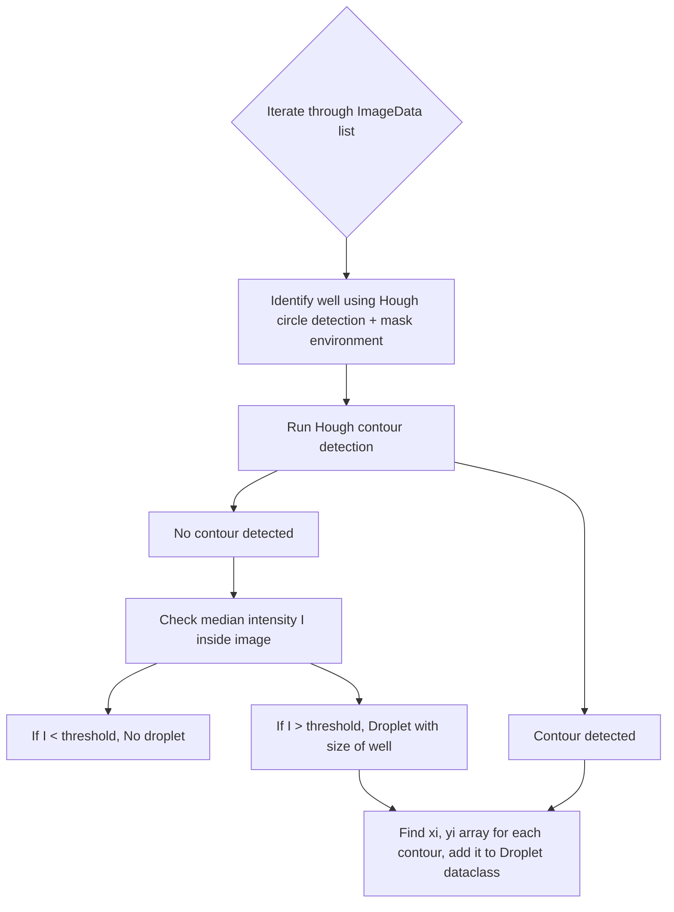

```mermaid
flowchart TD;
  C{Iterate through ImageData list}-->D[Identify well using Hough circle detection + mask environment];
  D-->F[Run Hough contour detection];
  F-->G[No contour detected];
  G-->H[Check median intensity I inside image];
  H-->I[If I < threshold, No droplet];
  H-->J[If I > threshold, Droplet with size of well];
  J-->L;
  F-->K[Contour detected];
  K-->L[Find xi, yi array for each contour, add it to Droplet dataclass];
```
